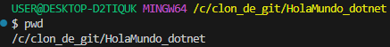
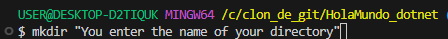
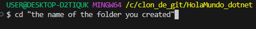
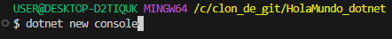
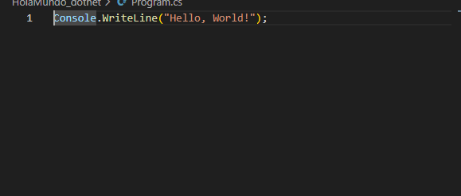
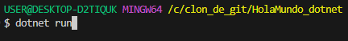
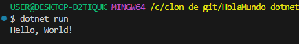

#  LEARNING TO USE .NET
____
First we check which directory we are in,and to see which directory we are, use pwd.

____

Next, we have the following command that will automatically create our folder.

____
Then we enter the folder with the following command,this command is used to go directly to the folder you created.

_____
Here's a command that will help us start creating your code.

After creating your console, a small piece of C# code will appear.

_____
And finally, to run that code, we use the following command.

 and it will come out like this.

 
____